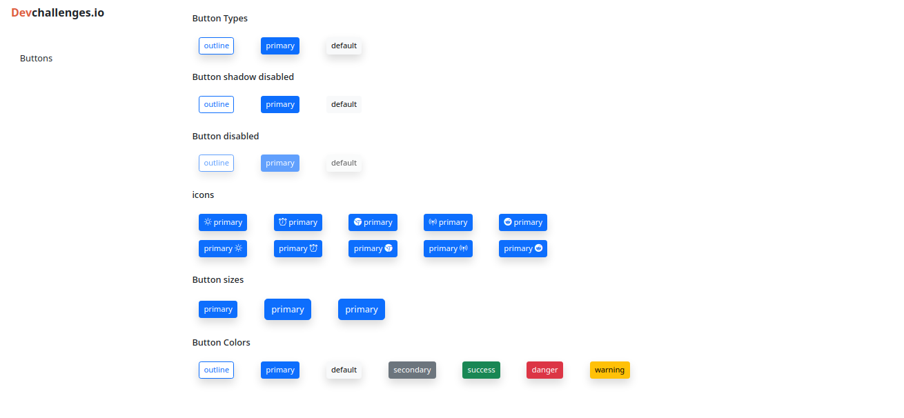

<!-- Please update value in the {}  -->

<h1 align="center">Reusable Component</h1>

<div align="center">
   Solution for reusable component from  <a href="http://devchallenges.io" target="_blank">Devchallenges.io</a>.
</div>

<div align="center">
  <h3>
    <a href="https://btn-component.vercel.app/">
      Demo
    </a>
    <span> | </span>
    <a href="https://github.com/qurriahSam/btn-component">
      Solution
    </a>
    <span> | </span>
    <a href="https://devchallenges.io/challenges/ohgVTyJCbm5OZyTB2gNY">
      Challenge
    </a>
  </h3>
</div>

<!-- TABLE OF CONTENTS -->

## Table of Contents

- [Overview](#overview)
- [Screenshot](#screenshot)
- [Built With](#built-with)
- [Features](#features)
- [How to use](#how-to-use)
- [Contact](#contact)

<!-- OVERVIEW -->

## Overview

The objective of this project entails the development of a reusable button component, It contains a selection of different colors, sizes, types, and icons. The aim is to create a solution that accommodates a range of user requirements, by offering an array of customization options.

## Screenshot

<p align=center></p>

## Built With

<!-- This section should list any major frameworks that you built your project using. Here are a few examples.-->

- [Angular](https://reactjs.org/)
- [Bootstrap](https://vuejs.org/)

## Features

<!-- List the features of your application or follow the template. Don't share the figma file here :) -->

This application/site was created as a submission to a [DevChallenges](https://devchallenges.io/challenges) challenge. The [challenge](https://devchallenges.io/challenges/ohgVTyJCbm5OZyTB2gNY) was to build an application to complete the given user stories.

## How To Use

<!-- This is an example, please update according to your application -->

To clone and run this application, you'll need [Git](https://git-scm.com) and [Node.js](https://nodejs.org/en/download/) (which comes with [npm](http://npmjs.com)) installed on your computer. From your command line:

```zsh
# Clone this repository
$ git clone https://github.com/qurriahSam/btn-component.git

# Install dependencies
$ npm install

# Run the app
$ ng serve
```

## Contact

- LinkedIn [Sam Kuria](https://www.linkedin.com/in/sam-kuria/)
